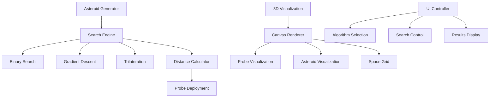

# 3D Asteroid Finder System

## 📋 Описание задачи / Task Description

### Русский

Разработать систему поиска астероида в трехмерном космическом пространстве с использованием оптимальных алгоритмов поиска. Система должна минимизировать количество используемых зондов для точного определения координат астероида в кубе размером 100×100×100.

**Основные требования:**
- Генерация случайного местоположения астероида в кубе 100×100×100
- Функция определения расстояния от зонда до астероида
- Реализация оптимальных алгоритмов поиска (Binary Search, Gradient Descent, Trilateration)
- 3D визуализация процесса поиска
- Минимизация количества используемых зондов

### English

Develop a system for finding an asteroid in three-dimensional space using optimal search algorithms. The system should minimize the number of probes used to accurately determine asteroid coordinates in a 100×100×100 cube.

**Main requirements:**
- Generate random asteroid location in 100×100×100 cube
- Function to determine distance from probe to asteroid
- Implementation of optimal search algorithms (Binary Search, Gradient Descent, Trilateration)
- 3D visualization of search process
- Minimize number of probes used

## 🏗️ Архитектура приложения / Application Architecture



### Компоненты системы / System Components

1. **AsteroidFinderEngine** - Основной движок поиска с алгоритмами
2. **AsteroidVisualization** - 3D визуализация космического пространства
3. **SearchAlgorithms** - Реализация алгоритмов поиска
4. **ProbeManager** - Управление развертыванием зондов

## ⚙️ Как работает приложение / How the Application Works

### Русский

1. **Генерация астероида**: Система случайно размещает астероид в кубе 100×100×100
2. **Выбор алгоритма**: Пользователь выбирает алгоритм поиска
3. **Развертывание зондов**: Алгоритм определяет координаты для размещения зондов
4. **Измерение расстояний**: Каждый зонд измеряет расстояние до астероида
5. **Анализ данных**: Алгоритм анализирует полученные расстояния
6. **Уточнение поиска**: Процесс повторяется до достижения требуемой точности
7. **Визуализация**: 3D сцена отображает процесс поиска в реальном времени

**Алгоритмы поиска:**

- **Binary Search**: Деление пространства пополам по каждой оси
- **Gradient Descent**: Движение в направлении уменьшения расстояния
- **Trilateration**: Использование пересечения сфер для определения позиции

### English

1. **Asteroid Generation**: System randomly places asteroid in 100×100×100 cube
2. **Algorithm Selection**: User selects search algorithm
3. **Probe Deployment**: Algorithm determines coordinates for probe placement
4. **Distance Measurement**: Each probe measures distance to asteroid
5. **Data Analysis**: Algorithm analyzes obtained distances
6. **Search Refinement**: Process repeats until required accuracy is achieved
7. **Visualization**: 3D scene displays search process in real-time

**Search Algorithms:**

- **Binary Search**: Dividing space in half along each axis
- **Gradient Descent**: Moving in direction of decreasing distance
- **Trilateration**: Using sphere intersections to determine position

## 📊 Структура данных / Data Structure

### Input Parameters

```json
{
  "spaceSize": 100,
  "asteroidLocation": {
    "x": 34,
    "y": 50,
    "z": 60
  }
}
```

### Output Format

```json
{
  "result": {
    "algorithm": "Binary Search",
    "location": {
      "x": 34,
      "y": 50,
      "z": 60
    },
    "probes": {
      "count": 44,
      "coordinates": [
        {"x": 10, "y": 9, "z": 21},
        {"x": 50, "y": 50, "z": 50},
        {"x": 34, "y": 50, "z": 60}
      ]
    },
    "accuracy": 98,
    "metadata": {
      "timestamp": "2025-01-27T10:30:00Z",
      "spaceSize": 100,
      "searchDuration": 1250
    }
  }
}
```

### Probe Data Structure

```json
{
  "id": 1,
  "coordinates": {"x": 25, "y": 25, "z": 25},
  "distance": 43.588,
  "timestamp": 1643284200000
}
```

## 🎯 Алгоритмы поиска / Search Algorithms

### Binary Search Algorithm

**Принцип работы / Working Principle:**
- Деление пространства поиска пополам по каждой оси
- Определение направления поиска на основе расстояний
- Итеративное сужение области поиска

**Преимущества / Advantages:**
- Гарантированная сходимость
- Логарithmическая сложность
- Минимальное количество зондов

### Gradient Descent Algorithm

**Принцип работы / Working Principle:**
- Движение в направлении наибольшего уменьшения расстояния
- Адаптивный размер шага
- Проверка улучшения на каждом шаге

**Преимущества / Advantages:**
- Быстрая сходимость в простых случаях
- Интуитивно понятный подход
- Хорошо работает без локальных минимумов

### Trilateration Algorithm

**Принцип работы / Working Principle:**
- Размещение зондов в стратегических точках
- Использование пересечения сфер
- Решение системы уравнений

**Преимущества / Advantages:**
- Математически обоснованный подход
- Хорошая точность при правильном размещении зондов
- Устойчивость к шуму

## 🚀 Технические детали / Technical Details

### 3D Visualization Features
- Interactive camera controls (rotation, zoom)
- Real-time probe deployment visualization
- Animated asteroid with glow effects
- Coordinate grid and space boundaries
- Probe numbering and distance lines

### Performance Optimizations
- Efficient 3D projection algorithms
- Optimized canvas rendering
- Debounced user interactions
- Memory-efficient probe management

### Algorithm Optimizations
- Early termination conditions
- Adaptive step sizes
- Boundary checking
- Precision thresholds

### Architecture Patterns
- **Strategy Pattern**: For different search algorithms
- **Observer Pattern**: For real-time visualization updates
- **Command Pattern**: For search operations
- **Factory Pattern**: For probe creation

### Testing Coverage
- Unit tests for all search algorithms
- Accuracy verification tests
- Performance benchmarks
- Edge case testing (boundary conditions)

### Browser Compatibility
- Modern browsers with Canvas 2D support
- Responsive design for mobile devices
- Touch controls for mobile interaction
- Fallback for older browsers