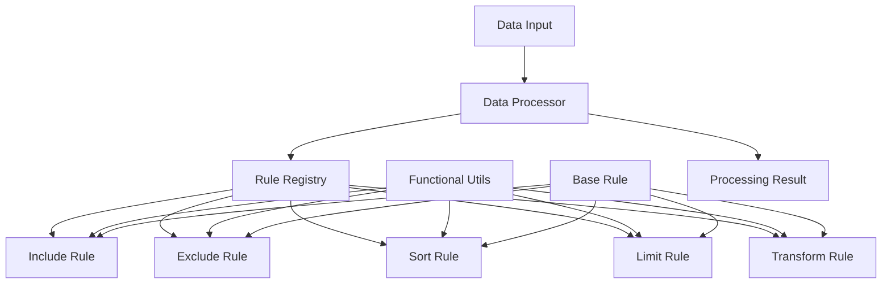

# Data Filter & Sort System

## 📋 Описание задачи / Task Description

### Русский

Разработать систему для сортировки и фильтрации JSON данных с использованием модульных правил обработки. Система должна поддерживать различные типы фильтров (include, exclude), сортировку с естественным порядком, ограничение результатов и трансформацию данных.

**Основные требования:**
- Фильтрация данных по правилам include/exclude с поддержкой AND/OR логики
- Сортировка с естественным порядком (natural sorting)
- Модульная архитектура с возможностью добавления новых правил
- Поддержка вложенных полей через dot notation
- Трансформация и вычисляемые поля

### English

Develop a system for sorting and filtering JSON data using modular processing rules. The system should support various filter types (include, exclude), natural order sorting, result limiting, and data transformation.

**Main requirements:**
- Data filtering with include/exclude rules supporting AND/OR logic
- Natural order sorting
- Modular architecture with ability to add new rules
- Nested field support through dot notation
- Transformation and computed fields

## 🏗️ Архитектура приложения / Application Architecture



### Компоненты системы / System Components

1. **DataProcessor** - Основной процессор данных
2. **RuleRegistry** - Реестр правил обработки
3. **BaseRule** - Базовый класс для всех правил
4. **Rule Modules** - Модули конкретных правил (Include, Exclude, Sort, Limit, Transform)
5. **FunctionalUtils** - Утилиты функционального программирования

## ⚙️ Как работает приложение / How the Application Works

### Русский

1. **Загрузка данных**: Система получает JSON данные для обработки
2. **Парсинг условий**: Анализируются правила обработки из объекта condition
3. **Валидация**: Проверяется корректность правил и данных
4. **Выполнение правил**: Правила выполняются в порядке приоритета:
   - Include (приоритет 1) - фильтрация нужных записей
   - Exclude (приоритет 2) - исключение ненужных записей
   - Transform (приоритет 15) - преобразование полей
   - Sort (приоритет 10) - сортировка результатов
   - Limit (приоритет 20) - ограничение количества
5. **Формирование результата**: Возвращается обработанный массив с метаданными

**Логика фильтрации:**
- **AND логика**: `{"name": "John", "status": "active"}` - запись должна соответствовать всем условиям
- **OR логика**: `[{"name": "John"}, {"name": "Jane"}]` - запись должна соответствовать любому условию

### English

1. **Data Loading**: System receives JSON data for processing
2. **Condition Parsing**: Processing rules are analyzed from condition object
3. **Validation**: Rules and data correctness is verified
4. **Rule Execution**: Rules are executed in priority order:
   - Include (priority 1) - filter needed records
   - Exclude (priority 2) - exclude unwanted records
   - Transform (priority 15) - transform fields
   - Sort (priority 10) - sort results
   - Limit (priority 20) - limit quantity
5. **Result Formation**: Returns processed array with metadata

**Filtering Logic:**
- **AND logic**: `{"name": "John", "status": "active"}` - record must match all conditions
- **OR logic**: `[{"name": "John"}, {"name": "Jane"}]` - record must match any condition

## 📊 Структура данных / Data Structure

### Input Format

```json
{
  "data": [
    {"name": "John", "email": "john2@mail.com", "age": 30, "status": "active"},
    {"name": "John", "email": "john1@mail.com", "age": 25, "status": "inactive"},
    {"name": "Jane", "email": "jane@mail.com", "age": 28, "status": "active"}
  ]
}
```

### Condition Format

```json
{
  "condition": {
    "include": [{"status": "active"}],
    "exclude": [{"name": "John", "email": "john2@mail.com"}],
    "sortBy": ["name", "email"],
    "limit": 10,
    "transform": {
      "fields": ["name", "email"],
      "computed": {
        "isAdult": "record => record.age >= 18",
        "displayName": "{{name}} ({{age}})"
      },
      "rename": {
        "name": "fullName"
      }
    }
  }
}
```

### Output Format

```json
{
  "result": [
    {"name": "Jane", "email": "jane@mail.com", "age": 28, "status": "active"}
  ],
  "metadata": {
    "inputCount": 3,
    "outputCount": 1,
    "processingTime": 15,
    "appliedRules": [
      {"type": "include", "priority": 1},
      {"type": "exclude", "priority": 2},
      {"type": "sortBy", "priority": 10}
    ]
  }
}
```

## 🎯 Ключевые особенности / Key Features

### Русский

- **Модульная архитектура**: Каждое правило - отдельный модуль
- **Функциональное программирование**: Чистые функции без побочных эффектов
- **Расширяемость**: Легкое добавление новых правил через наследование
- **Производительность**: Оптимизированные алгоритмы сортировки и фильтрации
- **Валидация**: Комплексная проверка входных данных и правил
- **Поддержка вложенных полей**: Доступ к полям через dot notation
- **Трансформация данных**: Вычисляемые поля и переименование

### English

- **Modular Architecture**: Each rule is a separate module
- **Functional Programming**: Pure functions without side effects
- **Extensibility**: Easy addition of new rules through inheritance
- **Performance**: Optimized sorting and filtering algorithms
- **Validation**: Comprehensive input data and rules verification
- **Nested Field Support**: Field access through dot notation
- **Data Transformation**: Computed fields and renaming

## 🚀 Технические детали / Technical Details

### Available Rules

1. **Include Rule**
   - Filters records that match specified criteria
   - Supports AND/OR logic
   - Priority: 1

2. **Exclude Rule**
   - Removes records that match specified criteria
   - Supports AND/OR logic
   - Priority: 2

3. **Sort Rule**
   - Sorts records by specified fields
   - Natural sorting algorithm
   - Multiple field sorting
   - Priority: 10

4. **Transform Rule**
   - Field selection and renaming
   - Computed fields with functions or templates
   - Priority: 15

5. **Limit Rule**
   - Limits number of output records
   - Supports offset for pagination
   - Priority: 20

### Architecture Patterns
- **Strategy Pattern**: For different rule types
- **Registry Pattern**: For rule management
- **Command Pattern**: For rule execution
- **Template Method**: For rule base class

### Functional Programming Features
- Immutable data operations
- Function composition and piping
- Currying and partial application
- Pure functions without side effects

### Performance Optimizations
- Lazy evaluation where possible
- Efficient sorting algorithms
- Memoization of expensive operations
- Minimal DOM manipulations

### Testing Coverage
- Unit tests for all rule modules
- Integration tests for complete workflows
- Edge case testing
- Performance benchmarks