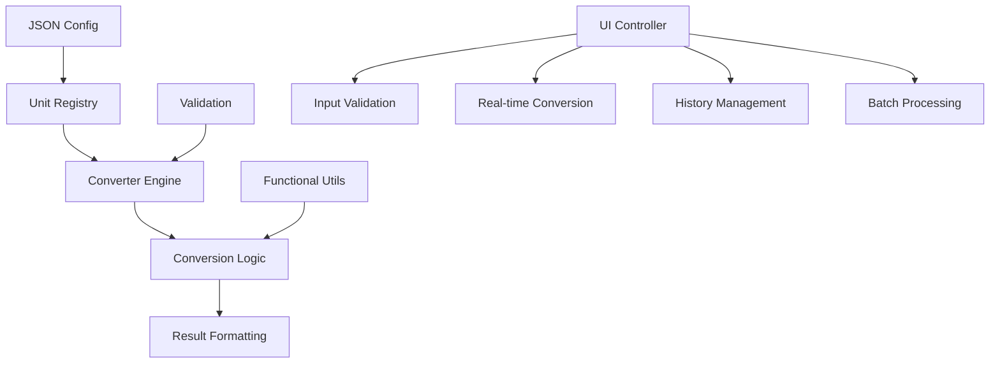

# Distance Converter System

## 📋 Описание задачи / Task Description

### Русский

Разработать приложение для конвертации между единицами измерения расстояния с поддержкой метрической и имперской систем. Система должна поддерживать расширение через JSON конфигурацию и обеспечивать точные вычисления с округлением до сотых.

**Основные требования:**
- Поддержка метрической системы: метры (m), сантиметры (cm), миллиметры (mm), километры (km)
- Поддержка имперской системы: футы (ft), дюймы (in), ярды (yd), мили (mi)
- Расширяемость через JSON конфигурацию
- Точность вычислений с округлением до 2 знаков после запятой
- Batch-обработка массивов конвертаций

### English

Develop an application for converting between distance units with support for metric and imperial systems. The system should support extension through JSON configuration and provide accurate calculations with rounding to hundredths.

**Main requirements:**
- Metric system support: meters (m), centimeters (cm), millimeters (mm), kilometers (km)
- Imperial system support: feet (ft), inches (in), yards (yd), miles (mi)
- Extensibility through JSON configuration
- Calculation accuracy with rounding to 2 decimal places
- Batch processing of conversion arrays

## 🏗️ Архитектура приложения / Application Architecture



### Компоненты системы / System Components

1. **UnitRegistry** - Реестр единиц измерения с возможностью расширения
2. **ConverterEngine** - Основной движок конвертации
3. **FunctionalUtils** - Утилиты функционального программирования
4. **ConverterUI** - Пользовательский интерфейс с валидацией

## ⚙️ Как работает приложение / How the Application Works

### Русский

1. **Инициализация**: Система загружает базовые единицы измерения в UnitRegistry
2. **Ввод данных**: Пользователь вводит значение и выбирает исходную единицу
3. **Валидация**: Проверяется корректность введенных данных
4. **Конвертация**: ConverterEngine выполняет преобразование через базовую единицу (метры)
5. **Форматирование**: Результат округляется до 2 знаков после запятой
6. **Отображение**: Результат отображается с анимацией и сохраняется в историю

**Принцип конвертации:**
- Все единицы имеют коэффициент преобразования к метрам
- Конвертация: исходное_значение × коэффициент_исходной_единицы ÷ коэффициент_целевой_единицы

### English

1. **Initialization**: System loads base units into UnitRegistry
2. **Data Input**: User enters value and selects source unit
3. **Validation**: Input data correctness is verified
4. **Conversion**: ConverterEngine performs transformation through base unit (meters)
5. **Formatting**: Result is rounded to 2 decimal places
6. **Display**: Result is displayed with animation and saved to history

**Conversion Principle:**
- All units have conversion factor to meters
- Conversion: source_value × source_unit_factor ÷ target_unit_factor

## 📊 Структура данных / Data Structure

### Input Format

```json
{
  "distance": {
    "unit": "m",
    "value": 0.5
  },
  "convertTo": "ft"
}
```

### Output Format

```json
{
  "unit": "ft",
  "value": 1.64
}
```

### Unit Configuration

```json
{
  "m": {
    "symbol": "m",
    "name": "meter",
    "system": "metric",
    "toMeters": 1,
    "category": "length"
  },
  "ft": {
    "symbol": "ft",
    "name": "foot",
    "system": "imperial",
    "toMeters": 0.3048,
    "category": "length"
  }
}
```

### Batch Processing

```json
[
  {
    "distance": { "unit": "m", "value": 1 },
    "convertTo": "ft"
  },
  {
    "distance": { "unit": "cm", "value": 100 },
    "convertTo": "in"
  }
]
```

## 🎯 Ключевые особенности / Key Features

### Русский

- **Точные вычисления**: Использование безопасных математических операций
- **Расширяемость**: Добавление новых единиц через JSON конфигурацию
- **Batch-обработка**: Конвертация массивов данных за один запрос
- **История конвертаций**: Сохранение и экспорт истории операций
- **Автоматическая конвертация**: Real-time обновление при изменении данных
- **Валидация**: Проверка корректности входных данных
- **Поиск оптимальных единиц**: Автоматический выбор наиболее читаемых единиц

### English

- **Accurate Calculations**: Using safe mathematical operations
- **Extensibility**: Adding new units through JSON configuration
- **Batch Processing**: Converting data arrays in single request
- **Conversion History**: Saving and exporting operation history
- **Auto-conversion**: Real-time updates when data changes
- **Validation**: Input data correctness verification
- **Optimal Unit Finding**: Automatic selection of most readable units

## 🚀 Технические детали / Technical Details

### Functional Programming Principles
- Pure functions without side effects
- Immutable data operations
- Function composition and currying
- Safe mathematical operations

### Supported Units

| Unit | Symbol | System | To Meters |
|------|--------|--------|-----------|
| Meter | m | metric | 1 |
| Centimeter | cm | metric | 0.01 |
| Millimeter | mm | metric | 0.001 |
| Kilometer | km | metric | 1000 |
| Foot | ft | imperial | 0.3048 |
| Inch | in | imperial | 0.0254 |
| Yard | yd | imperial | 0.9144 |
| Mile | mi | imperial | 1609.344 |

### Architecture Patterns
- **Registry Pattern**: For unit management
- **Strategy Pattern**: For different conversion strategies
- **Command Pattern**: For conversion operations
- **Observer Pattern**: For UI reactivity

### Performance Features
- Memoization of conversion factors
- Debounced input validation
- Efficient DOM updates
- Lazy loading of unit configurations

### Testing Coverage
- Unit tests for all conversion functions
- Edge case testing (zero, negative values)
- Integration tests for complete workflows
- Performance benchmarks