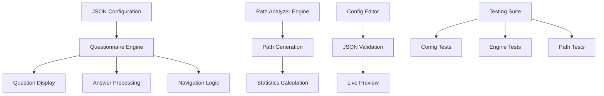

# Dynamic Questionnaire System

## 📋 Описание задачи / Task Description

### Русский

Разработать интерактивную систему опросника с динамической логикой переходов между вопросами на основе JSON конфигурации. Система должна поддерживать условные переходы, анализ всех возможных путей прохождения опросника и валидацию конфигурации.

**Основные требования:**
- Динамические переходы между вопросами на основе ответов
- JSON конфигурация для определения структуры опросника
- Анализ всех возможных путей прохождения
- Валидация конфигурации и обработка ошибок
- Возможность возврата к предыдущим вопросам

### English

Develop an interactive questionnaire system with dynamic question flow logic based on JSON configuration. The system should support conditional transitions, analysis of all possible questionnaire paths, and configuration validation.

**Main requirements:**
- Dynamic transitions between questions based on answers
- JSON configuration for defining questionnaire structure
- Analysis of all possible completion paths
- Configuration validation and error handling
- Ability to return to previous questions

## 🏗️ Архитектура приложения / Application Architecture



### Компоненты системы / System Components

1. **QuestionnaireEngine** - Основной движок опросника
2. **PathAnalyzerEngine** - Анализатор путей прохождения
3. **ConfigEditor** - Редактор конфигурации с валидацией
4. **TestingSuite** - Автоматизированное тестирование

## ⚙️ Как работает приложение / How the Application Works

### Русский

1. **Загрузка конфигурации**: Система загружает JSON конфигурацию с вопросами и правилами переходов
2. **Инициализация**: QuestionnaireEngine инициализируется с начального вопроса
3. **Отображение вопроса**: Текущий вопрос отображается с доступными вариантами ответов
4. **Обработка ответа**: При выборе ответа система определяет следующий вопрос или завершение
5. **Навигация**: Поддерживается возврат к предыдущим вопросам с сохранением истории
6. **Завершение**: По окончании отображаются все данные ответы пользователя

**Дополнительные возможности:**
- **Path Analyzer**: Анализирует все возможные пути прохождения опросника
- **Config Editor**: Позволяет редактировать конфигурацию с живым превью
- **Testing Suite**: Автоматически тестирует все компоненты системы

### English

1. **Configuration Loading**: System loads JSON configuration with questions and transition rules
2. **Initialization**: QuestionnaireEngine initializes from the starting question
3. **Question Display**: Current question is displayed with available answer options
4. **Answer Processing**: When answer is selected, system determines next question or completion
5. **Navigation**: Supports returning to previous questions with history preservation
6. **Completion**: Upon completion, displays all user answers

**Additional Features:**
- **Path Analyzer**: Analyzes all possible questionnaire completion paths
- **Config Editor**: Allows editing configuration with live preview
- **Testing Suite**: Automatically tests all system components

## 📊 Структура данных / Data Structure

### JSON Configuration Format

```json
{
  "startQuestion": "q1",
  "questions": {
    "q1": {
      "question": "What is your marital status?",
      "answers": {
        "Single": "q2",
        "Married": "q3",
        "Divorced": "q2",
        "Widowed": "q2"
      }
    },
    "q2": {
      "question": "Are you planning on getting married next year?",
      "answers": {
        "Yes": null,
        "No": null,
        "Maybe": null
      }
    }
  }
}
```

### Result Format

```json
{
  "answers": [
    {
      "questionId": "q1",
      "question": "What is your marital status?",
      "answer": "Single"
    }
  ],
  "progress": 100,
  "isComplete": true
}
```

## 🎯 Ключевые особенности / Key Features

### Русский

- **Условная логика**: Переходы между вопросами на основе ответов
- **Валидация**: Проверка корректности JSON конфигурации
- **Анализ путей**: Генерация всех возможных сценариев прохождения
- **Интерактивный редактор**: Редактирование конфигурации с живым превью
- **Автотестирование**: Комплексное тестирование всех компонентов
- **Адаптивный дизайн**: Оптимизация для всех устройств

### English

- **Conditional Logic**: Question transitions based on answers
- **Validation**: JSON configuration correctness checking
- **Path Analysis**: Generation of all possible completion scenarios
- **Interactive Editor**: Configuration editing with live preview
- **Auto-testing**: Comprehensive testing of all components
- **Responsive Design**: Optimization for all devices

## 🚀 Технические детали / Technical Details

### Architecture Patterns
- **Strategy Pattern**: For different question types
- **State Machine**: For questionnaire flow management
- **Observer Pattern**: For UI updates
- **Command Pattern**: For navigation actions

### Performance Optimizations
- Lazy loading of questions
- Memoization of path calculations
- Debounced validation
- Efficient DOM updates

### Testing Coverage
- Unit tests for all core functions
- Integration tests for complete flows
- Edge case testing
- Performance benchmarks